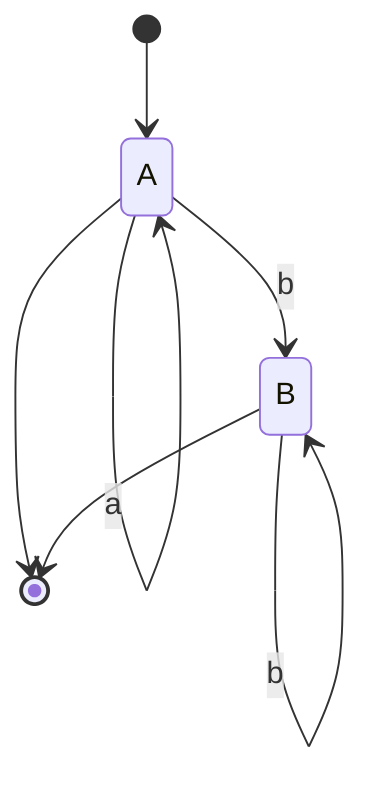

The **pumping lemma** gives a *necessary* condition for a language to be regular. It is most often used to **prove a language is _not_ regular**.

> If $L$ is regular, there exists a constant $p$ (the pumping length) such that every $w \in L$ with $|w| \ge p$ can be written $w = xyz$ where:
>
> 1. $|xy| \le p$
> 2. $|y| \ge 1$
> 3. $x y^{i} z \in L$ for all $i \ge 0$.

### Classic application

Show $L = \{a^n b^n \mid n \ge 0\}$ is **not** regular. Assume it is, with pumping length $p$; pick $w = a^p b^p$. By condition 1, $y$ is all $a$'s, so pumping $y$ changes the count of $a$'s but not $b$'s — contradiction.

A DFA for the *related* regular language $a^* b^*$:

See also [[toc.regular.refa]] and closure properties in [[toc.regular.reglang]].
